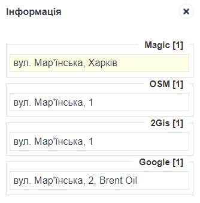
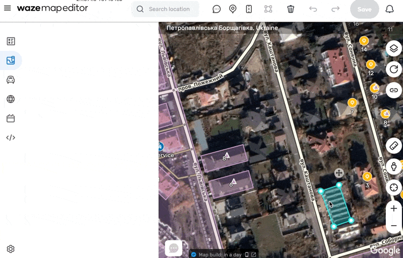
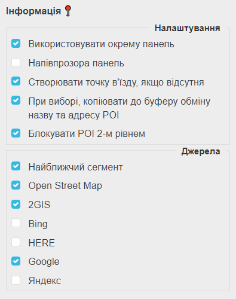
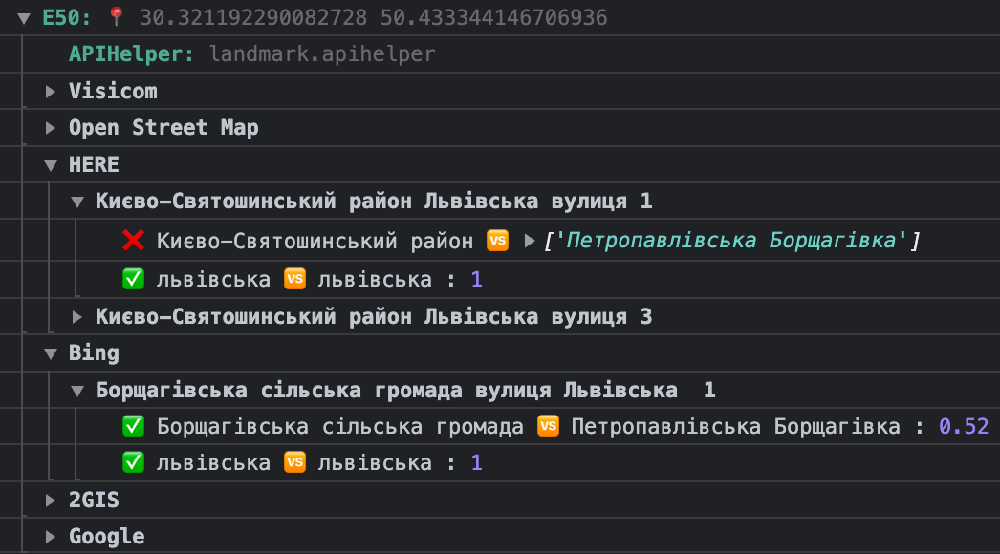

# WME 🇺🇦 E50
Fetch information about the Place from external sources






## Development

### Install & Build

```bash
npm install
npm run build       # one-off build → dist/WME-E50.user.js
npm run watch       # rebuild on changes
```

### Project Structure

Source is written in TypeScript under `src/`, built with Rollup into a single IIFE at `dist/WME-E50.user.js`.

```
src/
├── meta.ts              # userscript header
├── style.css            # plain CSS
├── globals.d.ts         # WME runtime globals + GM API
├── translations.ts      # i18n (en, uk, ru, fr)
├── types.ts, settings.ts, layers.ts  # constants
├── normalize.ts         # string normalization + fuzzy matching
├── detect.ts            # city/street detection via WmeSDK
├── providers/
│   ├── base.ts          # Provider base class
│   ├── magic.ts         # local segment data
│   ├── ua-addresses.ts  # Ukrainian address DB
│   ├── visicom.ts       # Visicom geocoding
│   ├── osm.ts           # OpenStreetMap Nominatim
│   ├── here.ts          # HERE reverse geocoding
│   ├── bing.ts          # Bing Maps
│   └── google.ts        # Google Maps Places
├── e50.ts               # E50 class (main logic)
├── helpers.ts           # event handlers
└── index.ts             # bootstrap
```

## Settings



## Console



## Links

Author homepage: https://anton.shevchuk.name/  
Author pet projects: https://hohli.com/  
Support author: https://donate.hohli.com/  
Script homepage: https://github.com/AntonShevchuk/wme-e50/  
GreasyFork: https://greasyfork.org/uk/scripts/389143-wme-e50-fetch-poi-data  
