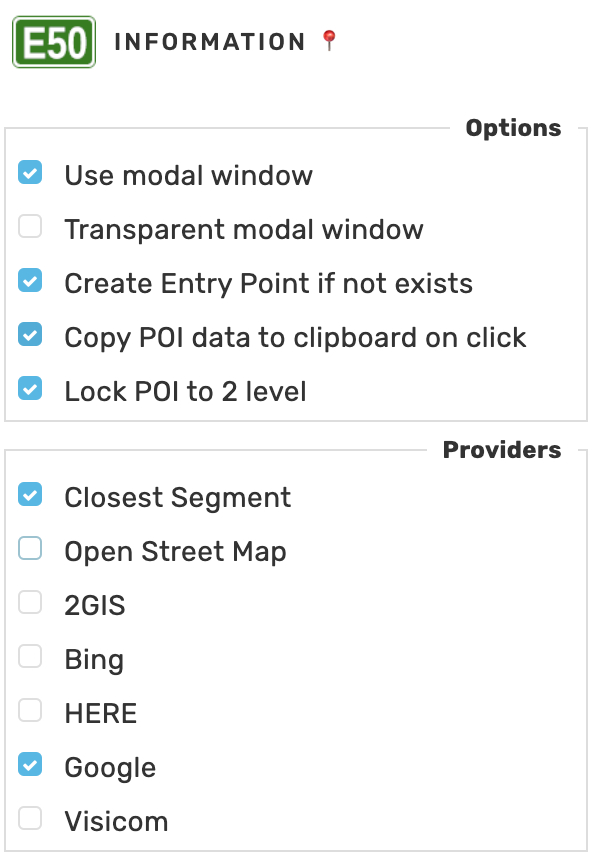

# WME E50
Fetch information about the POI from external sources

## Settings

## Console

## Links

Author homepage: https://anton.shevchuk.name/  
Author pet projects: https://hohli.com/  
Script homepage: https://github.com/AntonShevchuk/wme-e50/  
GreasyFork: https://greasyfork.org/uk/scripts/389143-wme-e50-fetch-poi-data  
